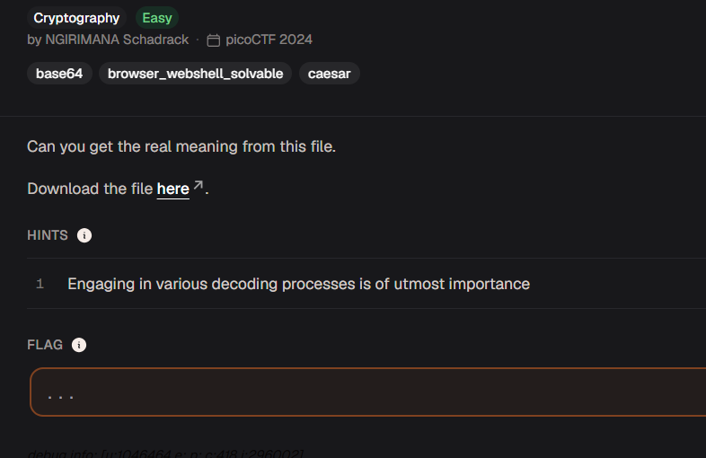

# interencdec



| Field | Details |
| --- | --- |
| Platform | picoCTF |
| Category | Cryptography |
| Status | Solved |
| Techniques | Base64, Caesar cipher |

## Challenge

The challenge provides a file named `enc_flag` containing an encoded string:

```text
YidkM0JxZGtwQlRYdHFhR3g2YUhsZmF6TnFlVGwzWVROclh6ZzJhMnd6TW1zeWZRPT0nCg==
```

The goal is to reverse each encoding layer and recover the flag.

## Solution

### 1. Decode the first Base64 layer

```bash
cat enc_flag | base64 --decode
```

Output:

```text
b'd3BqdkpBTXtqaGx6aHlfazNqeTl3YTNrXzg2a2wzMmsyfQ=='
```

The `b'...'` wrapper is Python's representation of a byte string. The value inside the quotes is another Base64 string.

### 2. Decode the second Base64 layer

```bash
echo 'd3BqdkpBTXtqaGx6aHlfazNqeTl3YTNrXzg2a2wzMmsyfQ==' | base64 --decode
```

Output:

```text
wpjvJAM{jhlzhy_k3jy9wa3k_86kl32k2}
```

The text has the shape of a flag, but its letters are shifted. This points to a Caesar cipher.

### 3. Reverse the Caesar cipher

Using a Caesar decoder with a shift of **7 backward** turns `wpjvJAM` into `picoCTF` and reveals the complete flag.

Decoder used: [dCode Caesar Cipher](https://www.dcode.fr/caesar-cipher)

## Flag

<details>
<summary>Click to reveal the flag</summary>

```text
picoCTF{caesar_d3cr9pt3d_86de32d2}
```

</details>

## Key takeaway

Encoded data can contain multiple layers. After each decoding step, inspect the output instead of assuming the job is finished. A familiar flag format is also a useful clue for identifying a substitution or shift cipher.
