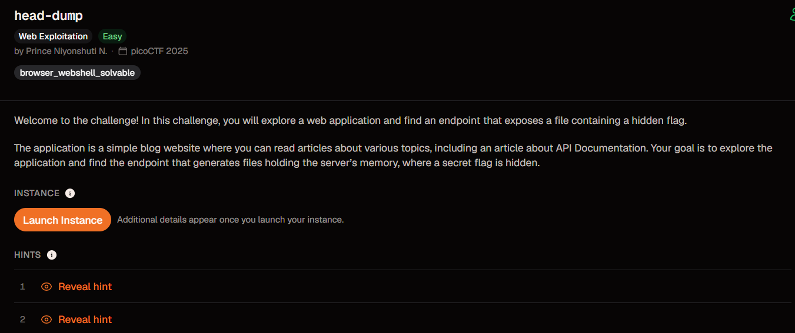

# head-dump



| Field | Details |
| --- | --- |
| Platform | picoCTF |
| Category | Web Exploitation |
| Status | Solved; final flag value was not recorded |
| Techniques | API documentation review, exposed heap dump, `strings`, regex search |

## Challenge

The challenge site exposes API documentation. Inspecting those docs reveals a heap dump endpoint that can be downloaded and searched for sensitive data.

## Initial analysis

The main page linked to the API documentation:

```text
http://verbal-sleep.picoctf.net:49357/api-docs/
```

The host and port belonged to a temporary picoCTF instance and may no longer be available.

The API documentation showed an endpoint named `/heapdump`:


## Solution

### 1. Open the API documentation

Visit the API documentation from the challenge site:

```text
http://verbal-sleep.picoctf.net:49357/api-docs/
```

Reviewing the routes exposed a diagnostic endpoint:

```text
/heapdump
```

### 2. Download the heap snapshot

Change the URL to the heap dump endpoint:

```text
http://verbal-sleep.picoctf.net:49357/heapdump
```

This downloads a `.heapsnapshot` file from the running service.

### 3. Search the heap dump for the flag

Search the printable strings in the downloaded heap snapshot for the picoCTF flag format:

```bash
strings heapdump-1786796296678.heapsnapshot | grep -E "picoCTF\{[^}]+\}"
```

The source note records this command, but it does not include the output. The heap snapshot file was not present locally, so the exact flag value could not be independently verified from the available evidence.

## Flag

<details>
<summary>Click to reveal the flag status</summary>

```text
Not recorded in the source note.
```

</details>

## Key takeaway

Exposed diagnostic endpoints can leak sensitive runtime data. When a web challenge provides API documentation, review it carefully for hidden or debugging endpoints before attempting more complex attacks.
