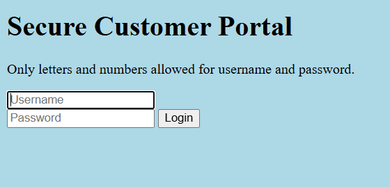

# Local Authority



| Field | Details |
| --- | --- |
| Platform | picoCTF |
| Category | Web Exploitation |
| Status | Solved; final flag value was not recorded |
| Techniques | Browser developer tools, Network tab inspection, client-side JavaScript review, exposed credentials |

## Challenge

The challenge presents a login page. The objective is to find valid credentials, access the protected page, and retrieve the flag.

## Initial analysis

The source note records an initial login attempt with common credentials:

```text
username: admin
password: admin
```

That attempt did not solve the challenge, so the next step was to inspect what the page loaded in the browser.

## Solution

### 1. Try the login form

Submit the obvious `admin:admin` credentials to observe the application's behavior and trigger the relevant network activity.

### 2. Inspect loaded files

Open the browser developer tools and check the Network tab while logging in again.

The source note records that a JavaScript file named `secure.js` was loaded. Inspecting that file revealed the valid login credentials. The exact password was not preserved in the note, so it is not reproduced here.

### 3. Log in with the discovered credentials

Use the credentials found in `secure.js` on the login form. The source note states that this led to the flag.

## Flag

<details>
<summary>Click to reveal the flag status</summary>

```text
Not recorded in the source note.
```

</details>

## Key takeaway

Client-side authentication logic is visible to users and should not be trusted for real access control. In web CTF challenges, checking loaded JavaScript files can quickly reveal hidden credentials or validation logic.
